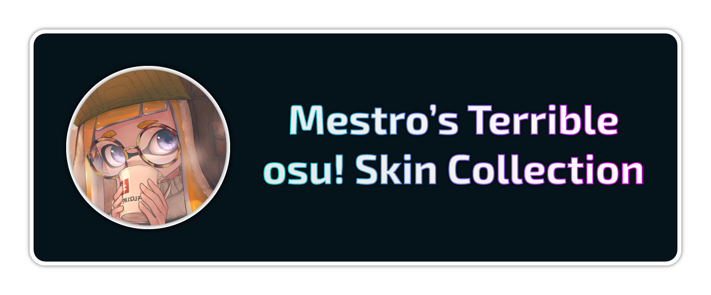

<h4 align="center">Collection of osu!lazer skins</h4>

    
    

    
    

---

# Skins

## Nanolight   

### [Download Latest Version](https://github.com/ItsMestro/osu-skins/releases/latest)

> Designed on lazer version: [2023.1231.0](https://github.com/ppy/osu/releases/tag/2023.1231.0)

My own personal skin that I use for almost all gameplay. Still very much WIP with support for taiko and catch to come, hopefully.

### Requirements

- UI Scaling: **0.85x**
- Aspect Ratio Above: **5:3**
  - Skin was designed with **16:9** in mind but most other aspect ratios should still work fine.

### TODO

- [ ] Add support for catch.
- [ ] Add support for taiko.
- [ ] Support any UI scale.
  - [ ] Release versions for more than one UI scale.
  - [ ] Make tool to auto convert skin for any UI scale.
- [ ] Support lower aspect ratios.
- [ ] Improve UI uniformity as skin editor gets more feature rich.

---

## License

All texture assets in the skin have been designed by me and is covered under [CC0-1.0](https://creativecommons.org/publicdomain/zero/1.0/). For details refer to the [license file](/LICENSE).

Audio resources come from a mixture of locations:

- [ppy/osu-resources](https://github.com/ppy/osu-resources) which uses [CC-BY-NC 4.0](https://creativecommons.org/licenses/by-nc/4.0/legalcode).
- [Custom hitsound library](https://osu.ppy.sh/wiki/en/Guides/Custom_hitsound_library)
- Various open source resources across the web.
